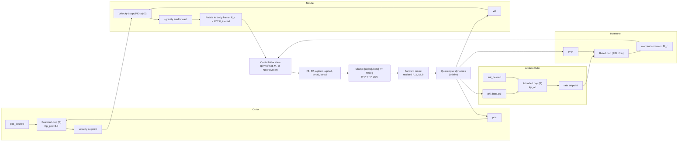

# Bi-Rotor Tilt-Rotor UAV — Cascaded PID Control

> **Attribution.** The vehicle concept, the dual-axis-tilt rigid-body model, and the geometric control-allocation formulation used in this repository are not original to this repository — they come from a published paper by other authors, included here as [`ICC25_0175_FI.pdf`](./ICC25_0175_FI.pdf) (full citation in [References](#references)). That paper derives the dynamics, proposes a **constant** allocation matrix, and controls the vehicle with a **robust backstepping** controller. This repository re-derives the same rigid-body dynamics and the same rotor moment-arm/allocation geometry from that paper, then experiments with an alternative, **linear** control design on top of it: a cascaded PID controller (with a **dynamically** rebuilt, rather than constant, allocation matrix), plus a learned neural-network allocation mixer. The main original contribution of this repository is setting up the SolidWorks -> URDF -> Gazebo/ROS simulation ("SITL") pipeline for the vehicle (`Birotor_Assembly.SLDASM`, `Birotor_Gzmodel/`), which is not part of the cited paper.

## Project overview

This repository contains a single Jupyter notebook, `Bi_rotor_PID_Control.ipynb`, that simulates the flight dynamics and control of a tilt-rotor bi-rotor UAV: a two-rotor aerial vehicle in which each rotor is mounted on a two-axis gimbal (independent tilt angles `alpha`, `beta`) instead of being fixed to the airframe like a conventional quadcopter arm. Because the vehicle has only two thrust-producing rotors but needs to command 6 degrees of freedom (3 forces + 3 moments), the rotor tilt angles are used as extra control inputs, turning the actuator set into an over/fully-actuated allocation problem rather than the fixed-mixing problem of a quadcopter.

The notebook addresses two things: (1) a 6-DOF rigid-body dynamic model of the vehicle driven by a cascaded PID controller (position -> velocity -> attitude -> body rate), with an analytic control-allocation step that inverts a 6x6 geometry-dependent mixing matrix to solve for the two thrust magnitudes and four tilt angles; and (2) a learned replacement for that analytic allocation step — a feed-forward neural network (`NeuralMixer`) trained on data generated from the same analytic mixer, intended to approximate the same body-frame-force/moment -> actuator-command mapping without an explicit matrix pseudo-inverse at runtime.

A SolidWorks CAD assembly and its exported URDF/Gazebo package are also present in the repository (see "SolidWorks CAD, URDF Export, and Gazebo/ROS Simulation Pipeline" below); there is no PX4 flight-stack integration.

## Vehicle model

### State vector

The `Quadcopter` class integrates a 12-dimensional state:

$$
x = [\,x,\ y,\ z,\ v_x,\ v_y,\ v_z,\ p,\ q,\ r,\ \phi,\ \theta,\ \psi\,]^T
$$

- Position (indices 0-2): $x, y, z$ — inertial-frame position, m
- Velocity (indices 3-5): $v_x, v_y, v_z$ — inertial-frame velocity, m/s
- Body angular rate (indices 6-8): $p, q, r$ — rad/s, in the body frame
- Attitude (indices 9-11): $\phi, \theta, \psi$ — roll, pitch, yaw, ZYX Euler angles, rad

### Dynamics

Translational dynamics (Newton's second law, body force rotated into the inertial frame):

$$
\ddot{\mathbf{x}} = R(\phi,\theta,\psi)\, \frac{F_b}{m} - g\,\hat{z}
$$

Rotational dynamics (Euler's rigid-body equation):

$$
\dot{\boldsymbol\omega} = J^{-1}\left(M_b - \boldsymbol\omega \times J\boldsymbol\omega\right)
$$

Attitude kinematics (body rates to Euler angle rates):

$$
\dot{\boldsymbol\Theta} = T(\phi,\theta)\,\boldsymbol\omega,\qquad
T(\phi,\theta) =
\begin{bmatrix}
1 & \sin\phi\tan\theta & \cos\phi\tan\theta \\
0 & \cos\phi & -\sin\phi \\
0 & \sin\phi/\cos\theta & \cos\phi/\cos\theta
\end{bmatrix}
$$

$R$ is the standard ZYX body-to-inertial rotation matrix built from $\phi,\theta,\psi$. $F_b$ is total force in the body frame (sum of both rotor thrust vectors); $M_b$ is total body-frame moment. $J$ is diagonal. Integration is performed with `scipy.integrate.odeint` (LSODA/ODE solver family), stepped one control-cycle at a time.

### Geometry and physical parameters

All constants are defined in the notebook's `main()` functions and the `CascadedPIDController` constructor.

| Symbol | Value | Unit | Meaning |
|---|---|---|---|
| $m$ | 1.5 | kg | Vehicle mass |
| $I_{xx}, I_{yy}$ | 0.015 | kg·m² | Roll/pitch principal moments of inertia |
| $I_{zz}$ | 0.03 | kg·m² | Yaw principal moment of inertia |
| $g$ | 9.81 | m/s² | Gravitational acceleration |
| $l$ | 0.3 | m | Arm length (lateral offset of each rotor mount from the body center, along body y) |
| $b_1$ | 0.03 | m | Rotor-mount geometry constant (axial offset term in moment-arm calc) |
| $b_2$ | 0.05 | m | Rotor-mount geometry constant (radial offset term, modulated by tilt angle) |
| $c_1$ | 0.03 | m | Rotor-mount geometry constant (body-z offset term) |
| $k$ | 0.017 | — | Drag-to-thrust ratio $k_d/k_m$ (reaction-torque coefficient per unit thrust) |
| Max tilt | 40 | deg | Servo tilt-angle limit on $\alpha_1,\alpha_2,\beta_1,\beta_2$ (clamp in `clampAngles`) |
| $F_{max}$ | 15.0 | N | Per-rotor thrust clamp used in `compute_control` |
| $dt$ (dynamics loop) | 0.001 | s | Control/integration time step in the PID-only simulation (1 kHz) |
| $dt$ (neural-mixer loop) | 0.005 | s | Control/integration time step in the neural-mixer simulation (200 Hz) |
| Sim duration | ~59.99 | s | Length of `tspan` in both `main()` functions |

The rotor moment-arm vectors used in the allocation matrix (see below) are, for rotor 1 (analogous for rotor 2 with sign flips on the $y$ term):

$$
\ell_1 = \begin{bmatrix}
(b_1 + b_2\cos\beta_1)\sin\alpha_1 \\
l - b_2\sin\beta_1 \\
c_1 + (b_1 + b_2\cos\beta_1)\cos\alpha_1
\end{bmatrix}
$$

## Control architecture

The controller (`CascadedPIDController.compute_control`) is a four-loop cascade: an outer position loop and inner velocity loop produce a body-frame force command; an outer attitude loop and inner body-rate loop produce a body-frame moment command. Both PID loops use trapezoidal integration with anti-windup clamping (`PIDController.update`).

| Loop | Type | Input error | Output | Gains |
|---|---|---|---|---|
| Position (outer) | P only | $pos_{desired} - pos$ | Velocity setpoint | $K_{p,pos} = 3.0$ |
| Velocity x (inner) | PID | $v_{sp,x} - v_x$ | Force command $F_{c,x}$ | $K_p=2.4,\ K_i=0.5,\ K_d=0.2$, integral limit 5.0 |
| Velocity y (inner) | PID | $v_{sp,y} - v_y$ | Force command $F_{c,y}$ | $K_p=2.2,\ K_i=0.5,\ K_d=0.1$, integral limit 5.0 |
| Velocity z (inner) | PID | $v_{sp,z} - v_z$ | Force command $F_{c,z}$ | $K_p=2.5,\ K_i=0.5,\ K_d=0.2$, integral limit 5.0 |
| Attitude (outer) | P only | $eul_{desired} - [\phi,\theta,\psi]$ | Body-rate setpoint | $K_{p,att} = 1.5$ (PID-only mixer) / $1.2$ (neural-mixer version) |
| Rate p (inner) | PID | $\omega_{sp,p} - p$ | Moment command $M_{c,p}$ | $K_p=1.5,\ K_i=0.1,\ K_d=0.0$, integral limit 3.0 (PID mixer); $K_p=1.2,\ K_i=0.1,\ K_d=0.01$ (neural mixer) |
| Rate q (inner) | PID | $\omega_{sp,q} - q$ | Moment command $M_{c,q}$ | same as rate p |
| Rate r (inner) | PID | $\omega_{sp,r} - r$ | Moment command $M_{c,r}$ | $K_p=1.5,\ K_i=0.1,\ K_d=0.0$, integral limit 2.0 (PID mixer); $K_p=1.2,\ K_i=0.1,\ K_d=0.01$ (neural mixer) |

The force command is computed in the inertial frame (with gravity feedforward added), then rotated into the body frame with $F_c = R^T F_{inertial}$ before allocation.



## Control allocation

The allocator solves for the two thrust vectors that jointly produce a desired body-frame force/moment pair $(F_c, M_c)$. `get_dynamic_M(a1, a2, b1, b2)` builds a 6x6 matrix mapping each rotor's 3-axis thrust vector (in body-aligned components) to the combined 6-DOF wrench:

$$
M =
\begin{bmatrix}
1 & 0 & 0 & 1 & 0 & 0 \\
0 & 1 & 0 & 0 & 1 & 0 \\
0 & 0 & 1 & 0 & 0 & 1 \\
-k & -\ell_{1z} & \ell_{1y} & k & -\ell_{2z} & \ell_{2y} \\
\ell_{1z} & k & -\ell_{1x} & \ell_{2z} & -k & -\ell_{2x} \\
-\ell_{1y} & \ell_{1x} & -k & -\ell_{2y} & \ell_{2x} & k
\end{bmatrix}
$$

where the top three rows sum the two rotors' force components directly, and the bottom three rows are $\ell_i \times T_i$ (cross product of each rotor's moment arm with its thrust vector) plus a reaction-torque term scaled by $k = k_d/k_m$ on the rotor's own thrust axis. $\ell_1, \ell_2$ depend on the current tilt angles, so $M$ is rebuilt every control cycle from the previous cycle's realized angles (`alpha1_prev`, `alpha2_prev`, `beta1_prev`, `beta2_prev`) — the allocation is therefore a one-step-delayed linearization around the current tilt configuration, not an exact instantaneous inverse.

Given the desired wrench $[F_c; M_c] \in \mathbb{R}^6$, the raw per-axis thrust components $[a,b,c,d,e,f]$ (rotor 1 = $a,b,c$; rotor 2 = $d,e,f$, in body x/y/z) are recovered via the Moore-Penrose pseudo-inverse:

$$
[a,b,c,d,e,f]^T = M^{+}\,[F_c; M_c]
$$

`np.linalg.pinv` is used specifically (over a direct inverse) to avoid singular-matrix failures as the geometry matrix becomes near-singular at certain tilt configurations.

These raw components are then converted to physical actuator commands — one thrust magnitude and two tilt angles per rotor:

$$
T_i = \sqrt{a_i^2+b_i^2+c_i^2}, \qquad
\beta_i = \arctan2\!\left(-b_i,\ \sqrt{a_i^2+c_i^2}\right), \qquad
\alpha_i = \arctan2(a_i,\ c_i)
$$

After clamping ($|\alpha|,|\beta| \le 40°$, $0 \le T \le 15\,\text{N}$), a forward mixer reconstructs each rotor's actual thrust vector from the clamped $(T,\alpha,\beta)$:

$$
T_{i,\text{vec}} = T_i\begin{bmatrix}\sin\alpha_i\cos\beta_i \\ -\sin\beta_i \\ \cos\alpha_i\cos\beta_i\end{bmatrix}
$$

and re-applies $M$ (rebuilt at the clamped angles) to get the *realized* $F_b, M_b$ actually fed to the plant. The notebook logs the discrepancy between commanded and realized wrench (`force_err`, `moment_err`) as the allocation/saturation error.

## Neural mixer

`NeuralMixer` (PyTorch `nn.Module`) is intended to replace the pseudo-inverse allocation step above with a single forward pass.

**Architecture**: input is the 6-vector $[F_x,F_y,F_z,M_x,M_y,M_z]$. It is normalized as $(x - \text{offset})/\text{scale}$ with fixed buffers `in_scale = [5,5,5,2,2,2]` and `f_offset = [0,0,14.7,0,0,0]` (the 14.7 N offset removes the hover-thrust bias, i.e. $mg$ for $m=1.5$ kg). The normalized input passes through:

$$
6 \to 128 \to 128 \to 64 \to 6,\quad \text{LeakyReLU}(0.1)\ \text{between hidden layers, final } \tanh
$$

Output is split and denormalized: the first two channels map $[-1,1] \to [0, 15]$ N for $t_1, t_2$; the remaining four map $[-1,1] \to [-40°, 40°]$ (in rad) for $\alpha_1,\alpha_2,\beta_1,\beta_2$. Linear layer weights are Xavier-uniform initialized, biases set to 0.01 (`init_weights`).

**Training data generation** (`generate_allocation_data`): for each sample, a random current tilt state $(\alpha,\beta)$ is drawn uniformly from $[-0.3, 0.3]$ rad (applied equally to both rotors) and used to build $M$ via `get_dynamic_M`. A random command is drawn — lateral forces $F_x,F_y \sim U(-4,4)$ N, vertical force $F_z \sim U(8,22)$ N, moments $M_x,M_y,M_z \sim U(-1.5,1.5)$ N·m — and solved via `pinv(M) @ cmd` to get the ideal raw thrust components, from which $t_1,t_2,\alpha_1,\alpha_2,\beta_1,\beta_2$ are derived the same way as in the analytic controller. Samples are rejected (not included) if $t_1$ or $t_2$ falls outside $[0.2, 15]$ N, or if $|\alpha_1|$ or $|\beta_1|$ exceeds 40°(the notebook's filter only checks rotor 1's angles, not rotor 2's). The notebook generates 100,000 accepted samples (up to 20x that many attempts allowed).

**Loss and training**: MSE loss, computed separately for thrust outputs (channels 0-1) and angle outputs (channels 2-5), then combined as

$$
\mathcal{L} = \mathcal{L}_{thrust} + 25.0\,\mathcal{L}_{angles}
$$

The 25x weighting on angle error is explained in-notebook as compensating for angles having small numeric magnitude (radians) relative to their outsized effect on flight stability. Optimizer is Adam, lr=0.001, batch size 256, 1001 epochs, loss printed every 20 epochs (logged output shows weighted loss decreasing from ~3.20 to ~2.18 over training).

**Deployment**: a second `CascadedPIDController` class (defined later in the notebook, same name, overwriting the first) takes the trained `model` in its constructor and, in `compute_control`, replaces the `pinv(M)` allocation step with a single `model.forward()` call on the commanded $[F_c;M_c]$, then applies the same clamping and forward-mixer reconstruction as the analytic version. It is intended to remove the per-cycle pseudo-inverse (and the associated one-step-delayed-geometry linearization) from the control loop, trading it for a fixed-cost neural network evaluation trained to approximate the same mapping.

Trained weights are saved via `torch.save(model.state_dict(), ...)` to a Google Colab Drive path (`/content/drive/My Drive/neural_mixer_weights.pth`), i.e. the notebook was run in Google Colab; no weights file is present in this repository.

## SolidWorks CAD, URDF Export, and Gazebo/ROS Simulation Pipeline

**Source CAD**: `Birotor_Assembly.SLDASM`, a SolidWorks assembly (binary, ~2.2 MB) at the repository root. Per `Birotor_Gzmodel/export.log`, the assembly contains 36 components, including a `Pixhawk Pro FC` part (a physical flight-controller mockup for mass/CoG accuracy — this is a CAD part only, not a software integration) and a `BLDCMotor`.

**Export**: the assembly was exported with the SolidWorks-to-URDF Exporter plugin (SW2URDF, commit `1.5.1-0-g916b5db`, build `1.5.7152.31018`), producing the ROS1 catkin package `Birotor_Gzmodel/`. This is a classic Gazebo + ROS1 (`gazebo_ros`) package, not PX4 SITL and not Ignition/GZ Sim — "Gzmodel" in the package name comes from the exporter's default naming, not from Ignition Gazebo's `gz` tooling.

**URDF** (`Birotor_Gzmodel/urdf/Birotor_Gzmodel.urdf`): robot name `Birotor_Gzmodel`. Links: `base_link`, `Bottom_plate_chassis`, `Left_servo1`, `Left_servo2`, `Left_prop`, `Right_servo1`, `Right_servo2`, `Right_prop`, each with an inertial block, a visual mesh, and a matching collision mesh under `meshes/*.STL`. Joints:

| Joint | Type | Parent -> Child | Limits |
|---|---|---|---|
| `Bottom_plate_chassis` | fixed | `base_link` -> `Bottom_plate_chassis` | — |
| `Left_servo1_joint` | revolute | `Bottom_plate_chassis` -> `Left_servo1` | ±1.47 rad, effort 2.5, velocity 3 |
| `Left_servo2_joint` | revolute, **mimics** `Left_servo1_joint` (multiplier 1, offset 0) | `Left_servo1` -> `Left_servo2` | ±1.47 rad, effort 2.5, velocity 3 |
| `Left_prop_joint` | continuous | `Left_servo2` -> `Left_prop` | effort 10, velocity 500 |
| `Right_servo1_joint` | revolute | `Bottom_plate_chassis` -> `Right_servo1` | ±1.47 rad, effort 2.5, velocity 3 |
| `Right_servo2_joint` | revolute (no mimic tag) | `Right_servo1` -> `Right_servo2` | ±1.47 rad, effort 2.5, velocity 3 |
| `Right_prop_joint` | continuous | `Right_servo2` -> `Right_prop` | effort 10, velocity 500 |

`Birotor_Gzmodel/config/joint_names_Birotor_Gzmodel.yaml` lists the same six actuated joints as `controller_joint_names`.

**Launch files**:
- `Birotor_Gzmodel/launch/gazebo.launch` includes `$(find gazebo_ros)/launch/empty_world.launch`, publishes a static `base_link -> base_footprint` transform, and spawns the robot with:
  ```
  <node name="spawn_model" pkg="gazebo_ros" type="spawn_model"
        args="-file $(find Birotor_Gzmodel)/urdf/Birotor_Gzmodel.urdf -urdf -model Birotor_Gzmodel"
        output="screen" />
  ```
- `Birotor_Gzmodel/launch/display.launch` loads the URDF into `robot_description`, runs `joint_state_publisher` and `robot_state_publisher`, and launches `rviz` with `-d $(find Birotor_Gzmodel)/urdf.rviz`.

**Build/run**: `Birotor_Gzmodel/CMakeLists.txt` declares a standard `catkin` package (`find_package(catkin REQUIRED)`, `catkin_package()`, installs `config`, `launch`, `meshes`, `urdf`). To build and run it, the package must sit inside a catkin workspace's `src/` directory:
```
catkin_make        # or: catkin build
source devel/setup.bash
roslaunch Birotor_Gzmodel display.launch   # RViz visualization
roslaunch Birotor_Gzmodel gazebo.launch    # spawn into Gazebo classic
```
This catkin build/run sequence is the standard workflow implied by the `CMakeLists.txt`/`package.xml` structure; it is not itself quoted from a file in the repository (no top-level build script or README was exported alongside the package).

## Repository structure

```
.
├── Bi_rotor_PID_Control.ipynb     # Full simulation: plant model, cascaded PID controller,
│                                   # analytic pseudo-inverse allocation, NeuralMixer definition,
│                                   # training-data generation, training loop, and two
│                                   # closed-loop simulation/plotting runs (PID-only allocation
│                                   # and neural-mixer allocation).
├── ICC25_0175_FI.pdf               # The source paper this vehicle model/allocation
│                                   # formulation is taken from (see References).
├── Birotor_Assembly.SLDASM         # SolidWorks CAD assembly of the vehicle (source for
│                                   # the URDF export below).
└── Birotor_Gzmodel/                # ROS1 catkin package exported from the SolidWorks
    │                               # assembly via the SW2URDF plugin.
    ├── CMakeLists.txt              # Standard catkin build rules.
    ├── package.xml                 # catkin package manifest (deps: roslaunch,
    │                               # robot_state_publisher, rviz, joint_state_publisher, gazebo).
    ├── export.log                  # SW2URDF exporter log (components, timestamps, versions).
    ├── config/
    │   └── joint_names_Birotor_Gzmodel.yaml   # controller_joint_names list.
    ├── launch/
    │   ├── display.launch          # RViz visualization (joint_state_publisher + robot_state_publisher).
    │   └── gazebo.launch           # Spawns the URDF into Gazebo classic via gazebo_ros.
    ├── meshes/                     # Per-link STL visual/collision meshes.
    └── urdf/
        ├── Birotor_Gzmodel.urdf    # Exported URDF (8 links, 7 joints).
        └── Birotor_Gzmodel.csv     # Exporter-generated link/joint summary table.
```

## Getting started

The notebook was authored and last run in Google Colab (it contains a `google.colab.drive.mount` call for saving model weights). To run it:

**Dependencies** (imported in the notebook): `numpy`, `scipy` (`scipy.integrate.odeint`), `matplotlib`, `torch` (`torch.nn`, `torch.optim`, `torch.utils.data`). No `requirements.txt` or environment file is present in the repository.

**Running the notebook**:
1. Open `Bi_rotor_PID_Control.ipynb` in Jupyter or Google Colab.
2. Run cells top to bottom. The first `main()` (analytic pseudo-inverse allocation) can be run independently of the neural-mixer cells below it.
3. The neural-mixer section requires `torch`; it generates its own training data, trains `NeuralMixer` in-notebook, and then redefines `CascadedPIDController` to use the trained model before running the second `main()`.
4. The Google Drive mount/save cell (`VQBCfJQugLcf`) is Colab-specific and will fail outside Colab — skip it or replace with a local `torch.save`/`torch.load` path when running elsewhere.

**Running the Gazebo/RViz simulation pipeline**: requires ROS1 (catkin) and Gazebo classic. Place `Birotor_Gzmodel/` inside a catkin workspace's `src/` directory, then:
```
catkin_make
source devel/setup.bash
roslaunch Birotor_Gzmodel display.launch   # RViz
roslaunch Birotor_Gzmodel gazebo.launch    # Gazebo classic
```
This is not PX4 SITL — no flight-stack (PX4/ArduPilot) is wired into this package; it only spawns/visualizes the exported URDF.

## Current status and known limitations

- The vehicle model and both controllers exist only as an offline Python/PyTorch simulation; the notebook is not wired to the URDF/Gazebo pipeline (the two are separate, unconnected artifacts in this repository), and there is no hardware or flight-stack (PX4/ArduPilot) integration.
- The control-allocation matrix $M$ is rebuilt each cycle from the *previous* cycle's tilt angles, not the current ones — this is a one-step-delayed linearization, and the notebook explicitly logs the resulting `force_err`/`moment_err` discrepancy between commanded and realized wrench rather than eliminating it.
- The `NeuralMixer` training-data filter (`generate_allocation_data`) checks the 40° angle limit only for rotor 1 (`a1`, `be1`); rotor 2's angles (`a2`, `be2`) are not filtered, so out-of-limit rotor-2 targets can enter the training set even though they are clamped at inference time in `compute_control`.
- No accuracy/error comparison between the analytic pseudo-inverse mixer and the trained `NeuralMixer` is computed in the notebook beyond the per-run `force_err`/`moment_err` logging and a training-loss curve; there is no held-out validation/test split for the neural mixer.
- Trained neural-mixer weights are not included in the repository (saved only to a Colab Drive path at runtime).
- No automated tests, CI, or requirements file exist in the repository.
- The exported URDF is not fully symmetric: `Left_servo2_joint` carries a `<mimic>` tag locking it to `Left_servo1_joint` (multiplier 1, offset 0), but `Right_servo2_joint` has no equivalent `mimic` tag. If this is unintentional, the two rotors' tilt kinematics differ in the URDF even though the physical/CAD design and the notebook's dynamics treat both rotors symmetrically.
- `Birotor_Gzmodel/launch/display.launch` references an RViz config file, `$(find Birotor_Gzmodel)/urdf.rviz`, that is not present anywhere in the package — `display.launch` will fail to load a saved RViz layout as-is.
- `Birotor_Gzmodel/package.xml` still has exporter placeholder values for `<author>` (`TODO`) and `<maintainer email="TODO@email.com">`.
- There is no PX4 (or any flight-stack) integration; the "SITL" pipeline here is a URDF export spawned/visualized in Gazebo classic and RViz via ROS1, not a flight-controller-in-the-loop simulation.
- The notebook's controller (cascaded PID, dynamically rebuilt allocation matrix) is a deliberate departure from the cited paper's controller (backstepping, constant allocation matrix); no quantitative comparison between the two control designs is included in this repository.

## References

S. Seshasayanan, M. H. Khan, and S. R. Sahoo, "Modeling and Control of a Dual-Tilt Birotor UAV." Sathyanarayanan Seshasayanan and Soumya Ranjan Sahoo are with the Department of Electrical Engineering, Indian Institute of Technology Kanpur; Mohd Haisam Khan is with the Department of Electrical Engineering, Indian Institute of Technology Bhilai. Paper included in this repository: [`ICC25_0175_FI.pdf`](./ICC25_0175_FI.pdf).

That paper derives the same rigid-body dynamics and rotor moment-arm geometry ($r_1 = [(h_1+h_2\cos\beta_1)\sin\alpha_1,\ l-h_2\sin\beta_1,\ c_1+(h_1+h_2\cos\beta_1)\cos\alpha_1]^T$, matching this repository's $b_1,b_2,c_1$ notation) used in this repository's notebook, but controls the vehicle with a robust backstepping controller against a **constant** control-allocation matrix, rather than the cascaded PID / dynamically-rebuilt-allocation / neural-mixer designs explored here.

## TODO — verify

- The exact publication venue, year, and DOI/ISBN of the cited paper could not be confirmed from the PDF's extracted text (no conference header, DOI, or ISBN appears in the extracted text layer) — the filename `ICC25_0175_FI.pdf` suggests a 2025 conference submission numbered 175, but this should be confirmed against the authors' own record before citing it externally.
- Confirm whether the missing `Left_servo2_joint`/`Right_servo2_joint` `mimic`-tag asymmetry in the URDF and the missing `urdf.rviz` file are exporter artifacts to be fixed, or intentional.
- Confirm whether the notebook is meant to be run only in Google Colab (as its Drive-mount cell suggests) or is also expected to run in a local Jupyter environment — no environment/requirements file is present to indicate a target platform.
- Confirm the intended units/convention for $k = k_d/k_m = 0.017$ — the notebook comments it as a ratio but does not state the units of $k_d$ and $k_m$ individually.
- Confirm which ROS distribution / Gazebo version `Birotor_Gzmodel` targets — `package.xml` and `CMakeLists.txt` do not pin a ROS distro or Gazebo version.
